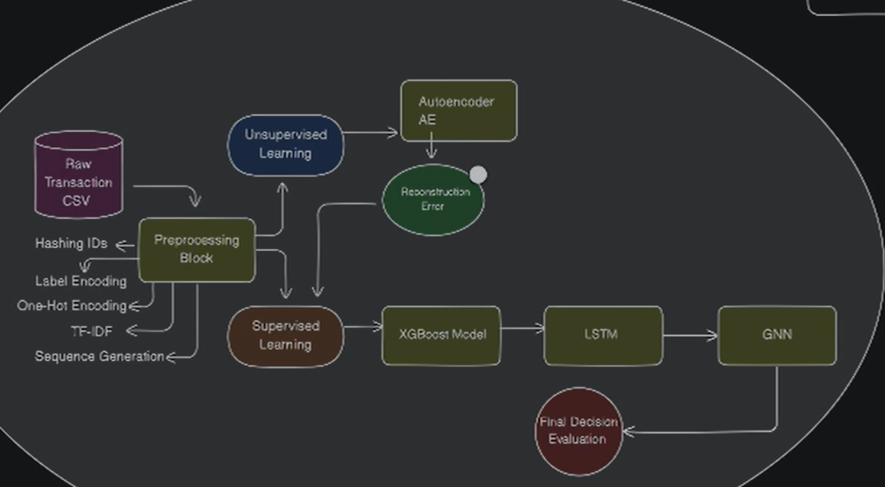
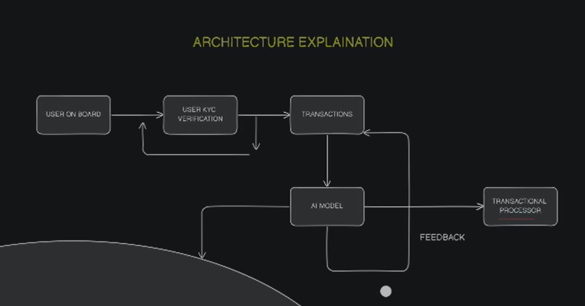

# Final

Title:
Multi-Agent AI System for Real-Time Fraud Detection in Financial Transactions

Abstract:
This project presents a real-time fraud detection pipeline using a multi-agent AI system. It integrates multiple AI models—AutoEncoder, XGBoost, LSTM, and Graph Neural Networks (GNNs)—to identify complex financial fraud patterns such as identity theft, refund abuse, and money laundering. The system ensures security, scalability, and interpretability, with preprocessing, sequential modeling, and transactional graph-based detection.

Problem Statement:
Modern financial systems are plagued by sophisticated frauds that bypass traditional rule-based detection. These include synthetic identities, laundering rings, fake refunds, and account takeovers. Our aim is to design a real-time, accurate, and interpretable system that detects fraud using both behavioral patterns and transaction graph analysis.

System Architecture:
Multi-Agent Detection Architecture

System Flow with KYC and AI Model Integration (Image 2: End-to-End Flow)

Modules Overview:
Data Preprocessing Block

Handles ID hashing, label encoding, one-hot encoding, TF-IDF, and sequence generation.

Feeds features into both supervised and unsupervised models.

Agent 1: AutoEncoder (Unsupervised)

Learns normal transaction patterns and flags deviations via reconstruction error.

Agent 2: XGBoost Classifier

Utilizes raw features and anomaly scores to detect high-risk transactions.

Agent 3: LSTM Model

Captures temporal transaction behavior to detect sequential anomalies.

Agent 4: GNN (GraphSAGE)

Constructs dynamic transaction graphs with nodes as users/devices/IPs and edges as activities (transfer/login/refund) to detect laundering rings, fraud loops, and collusion.

Technologies Used:
Languages: Python, JavaScript

Frameworks: FastAPI, React.js, NestJS, Node.js

ML/DL Libraries: TensorFlow, Keras, PyTorch, Scikit-learn, XGBoost

Database: MongoDB

Key Features:
Real-time fraud prediction API

Integration with KYC and transaction systems

Visualization of fraud score and graph structure

Extensible multi-agent pipeline

Future Enhancements:
Integrating LLMs for dynamic rule learning

Deploying on cloud infrastructure

Extending GNN to detect community-level fraud behavior

Conclusion:
The multi-agent approach leverages the strengths of anomaly detection, supervised learning, sequential modeling, and graph-based reasoning. It provides high accuracy and interpretability in real-time financial fraud detection.
